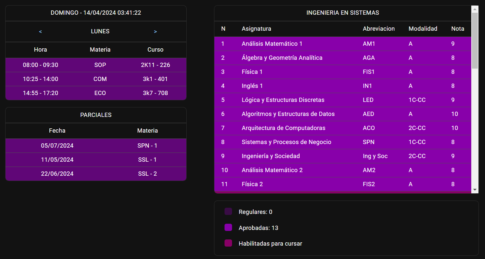

# Organizador de Universidad

Este es un proyecto de un organizador de horarios para estudiantes de Ingeniería en Sistemas de la Universidad Tecnológica FRC.

El Organizador de Universidad es una aplicación web que ayuda a los estudiantes de Ingeniería en Sistemas a gestionar y organizar sus horarios académicos de manera eficiente. La aplicación permite a los estudiantes crear, visualizar y gestionar sus horarios de clases, exámenes, ademas de poder ver de forma didactica sus correlatividades.

### Características principales:

- **Gestión de horarios:** Los estudiantes pueden crear y personalizar sus horarios de clases según sus necesidades y preferencias.
- **Gestión de parciales:** Los estudiantes pueden agregar la fecha de sus parciales y materias.
- **Correlatividades:** Los estudiantes al cargar sus notas pueden ir viendo las materias que puede ir cursando.
- **Acceso desde cualquier lugar:** La aplicación es accesible desde cualquier dispositivo con conexión a Internet, lo que permite a los estudiantes acceder a sus horarios en cualquier momento y lugar.

Para acceder al Organizador de Universidad, visita [https://mishorarios.netlify.app/](https://mishorarios.netlify.app/).
